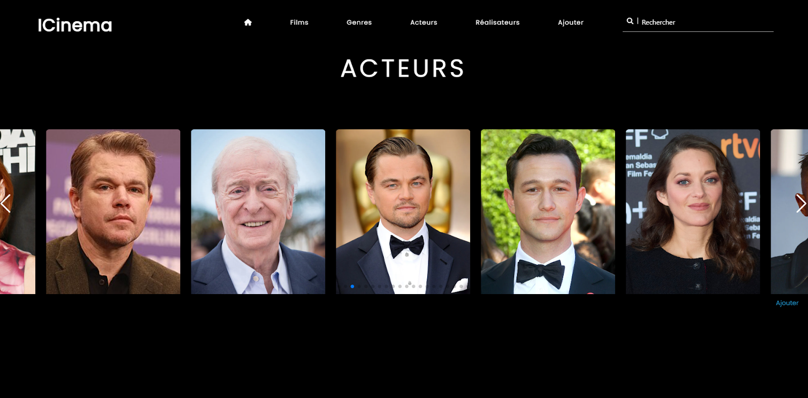
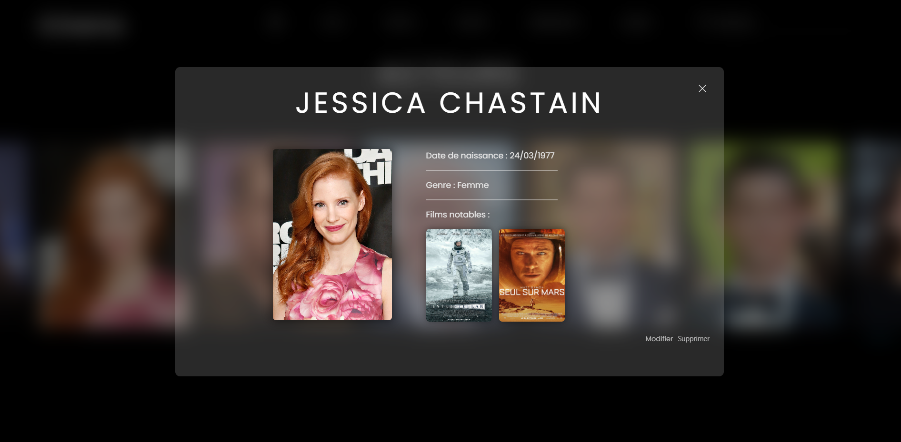
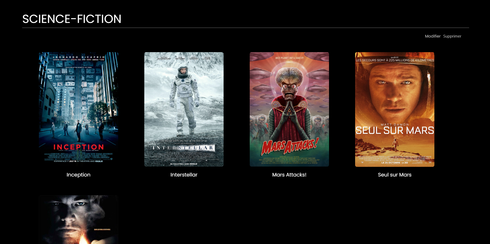
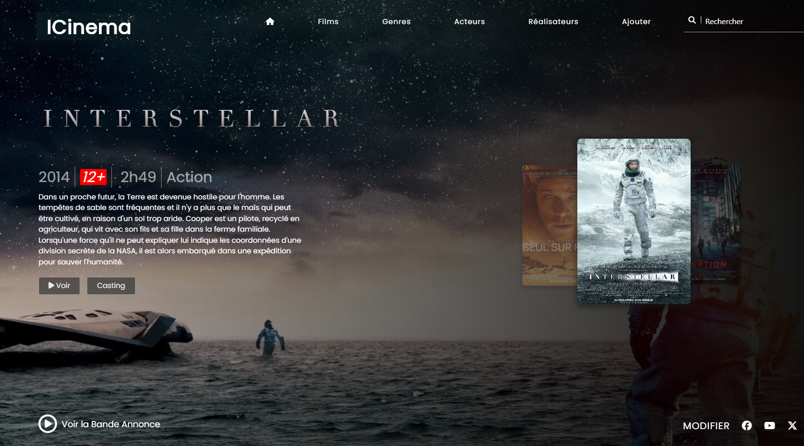
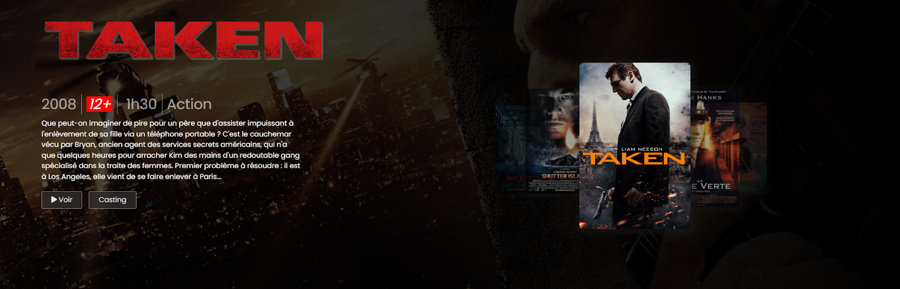

<h1 align="center">ICinema</h1>

<br/>

<h3>📃 Description</h3>
<br/>
<strong>ICINEMA</strong> est un projet de site web permettant de présenter des films avec leurs informations détaillées, y compris le casting - acteurs - et le réalisateur. Les films sont classés par genre, et il est possible d’ajouter, modifier ou supprimer chaque élément - casting, film, réalisateur, genre, etc.

<br/></br>

<h3 align="center">⚙️ Technologies utilisées</h3>

<p align="center">
  <a href="https://skillicons.dev">
    
  </a
</p>
<br/>
<br/>
<br/>

🔴<strong> PHP :</strong> Langage de programmation utilisé pour le développement du backend.<br/><br/>
🔴<strong> MySQL :</strong> Système de gestion de base de données relationnelle **(SGBDR)** pour stocker et gérer les données.<br/><br/>
🔴<strong> HeidiSQL :</strong> Outil d'administration de base de données utilisé pour gérer et administrer **MySQL**.<br/><br/>
🔴<strong> Laragon :</strong> Environnement de développement utilisé pour héberger l'application en local.<br/><br/>
🔴<strong> Looping :</strong> Outil de modélisation conceptuelle de données utilisé pour créer  : <br/><br/>
                              - le **Modèle Conceptuel de Données** (MCD)<br/>
                              - le **Modèle Logique de Données** (MLD).<br/>
<br/>
<br/>
<br/>

<h2 align="center">Listing des acteurs</h2>




</br>

<h2 align="center">Détails d'un acteur</h2>



</br>

<h2 align="center">Liste des films par genre</h2>




<br/>


<h3>🛠️ Détails Techniques</h3><br/>

<strong> MCD - MLD</strong> <br/><br/>
Pour ce projet, un Modèle Conceptuel de Données (MCD) et un Modèle Logique de Données (MLD) ont été créés afin de définir la structure de la base de données et les relations entre les entités. L’outil Looping a été utilisé pour cette modélisation.

<br/><br/>

<strong>  Maquette</strong> <br/><br/>
La création d'une maquette avec Figma a permis de définir la position des éléments visuels et d'améliorer les aspects UI/UX du projet.
<br/><br/>



<br/><br/>

<strong> HTML Sémantique et CSS</strong> <br/><br/>
Pour la structure de la page, le langage HTML a été utilisé avec des balises sémantiques pour améliorer l'accessibilité et le référencement. Le style de la page a été réalisé avec CSS, incluant des effets au survol pour améliorer l'expérience utilisateur.
  
<br/><br/>

<strong>  Templates Réutilisables</strong> <br/><br/>
Des templates réutilisables ont été créés et intégrés dans une mise en page - layout -  avec une gestion de temporisation de sortie grâce aux fonctions ob_start() et ob_get_clean() pour un rendu fluide.
<br/>

````php
<?php
    $title = "Liste des acteurs";
    $content = ob_get_clean();
    require "views/template.php";
?>
````
  
<br/><br/>

<strong>  MySQL</stronh> <br/><br/>
La base de données a été créée et gérée avec MySQL, utilisant le langage SQL pour manipuler les données.
<br/>

````php

public function findGenreByID($id) {

    $dao = new DAO();
    
    $sql = "SELECT g.genre_name, g.id_genre
            FROM genre g
            WHERE g.id_genre = :id";
    
    $sql1 ="SELECT g.genre_name, f.title, f.id_film, f.picture
            FROM genre g
            INNER JOIN film_genre fg ON fg.genre_id = g.id_genre
            INNER JOIN film f ON fg.film_id = f.id_film
            WHERE g.id_genre = :id";
    
    $params = [
        ':id' => $id,
    ];
}

`````


<br/><br/>

<strong>  Swiper.js</strong> <br/><br/>
La librairie Swiper.js a été utilisée pour ajouter de l'interactivité, permettant de présenter les affiches de films sous forme de carrousel sur la page d'accueil. </br></br>


  
<br/><br/>

<strong>  CRUD</strong> <br/><br/>
Des contrôleurs ont été mis en place pour gérer les opérations CRUD - Create, Read, Update, Delete - nécessaires à la gestion des données.
<br/>

````php
public function updateMovie($id)
````
<br/>

````php
public function addActor()
````
<br/>

````php
public function deleteGenre($id)
````

<br/><br/>

<strong>  Faille d’Upload </strong> <br/><br/>
Pour prévenir les failles de sécurité liées au téléchargement de fichiers malveillants, des vérifications de type MIME et de taille ont été mises en place. 
<br/>

````php
$allowed = [
    "jpg" => "image/jpg",
    "jpeg" => "image/jpeg",
    "png" => "image/png",
];
````

<br/>
<br/>


